# wrkflw Lifecycle Timeline

This diagram shows the normal `wrkflw` path from initial request through story closeout. It includes the early design-document and codebase-analysis pass before capability review. Human approval gates are shown as milestones. Artifact lists focus on the durable files that are created or materially updated at each point.

## Infographic Timeline

For the expanded vertical version with SWE-AF-inspired runtime, recovery, validation, and command details, open:

[wrkflw lifecycle deep map](wrkflw-lifecycle-deep-map.html)

## Technical Timeline

```mermaid
flowchart LR
    Start([Start: user request<br/>or design seed])
    Init[Initialize workflow workspace<br/>Create baseline control artifacts]
    Analysis[Design and codebase analysis<br/>Read design seed, inspect repo, normalize slice]
    Cap[Capability inventory<br/>Identify coverage breadth]
    GateCap{Human gate<br/>capability-review}
    Epic[Epic shaping<br/>Problem, goals, constraints]
    GateEpic{Human gate<br/>epic-shaping}
    Slice[Story slicing<br/>Small mergeable stories]
    GateSlice{Human gate<br/>story-slicing}
    Enrich[Story enrichment<br/>Scope, ACs, risks, tests]
    GateEnrich{Human gate<br/>story-enrichment}
    Spec[OpenSpec authoring<br/>Proposal, spec, tasks]
    GateSpec{Human gate<br/>spec-authoring}
    Plan[Implementation planning<br/>PR-sized slice and owners]
    GatePlan{Human gate<br/>implementation-planning}
    Exec[Implementation<br/>Code, tests, review evidence]
    Review[Review and verification<br/>Role reviews, CI, gates]
    GateReview{Human gate<br/>review}
    Release[Release planning<br/>Production readiness]
    GateRelease{Human gate<br/>release-planning}
    Done([Story done<br/>archive OpenSpec change])
    Next{More ready stories?}
    Complete([Workflow complete<br/>or next epic lane])

    Start --> Init --> Analysis --> Cap --> GateCap
    GateCap --> Epic --> GateEpic
    GateEpic --> Slice --> GateSlice
    GateSlice --> Enrich --> GateEnrich
    GateEnrich --> Spec --> GateSpec
    GateSpec --> Plan --> GatePlan
    GatePlan --> Exec --> Review --> GateReview
    GateReview --> Release --> GateRelease
    GateRelease --> Done --> Next
    Next -- yes --> Enrich
    Next -- no --> Complete

    classDef start fill:#eef2ff,stroke:#4f46e5,color:#111827,stroke-width:1px;
    classDef stage fill:#ecfeff,stroke:#0891b2,color:#111827,stroke-width:1px;
    classDef gate fill:#fff7ed,stroke:#ea580c,color:#111827,stroke-width:2px;
    classDef done fill:#ecfdf5,stroke:#059669,color:#111827,stroke-width:1px;

    class Start,Complete start;
    class Init,Analysis,Cap,Epic,Slice,Enrich,Spec,Plan,Exec,Review,Release stage;
    class GateCap,GateEpic,GateSlice,GateEnrich,GateSpec,GatePlan,GateReview,GateRelease,Next gate;
    class Done done;
```

## Artifact Update Map

```mermaid
flowchart TB
    subgraph Foundation["Workflow foundation"]
        A1[".workflow/<slug>/state.md"]
        A2[".workflow/<slug>/history.md"]
        A3[".workflow/<slug>/gates.md"]
        A4[".workflow/<slug>/workflow-contract.md"]
        A5[".workflow/<slug>/diagram-config.md"]
        A6[".workflow/initiative-index.md"]
    end

    subgraph Design["Design, codebase analysis, and capability shaping"]
        B0["design.md / docs/design.md"]
        B1["design-slice.md"]
        B2["codebase reconnaissance"]
        B3["capabilities.md"]
        B4["decisions.md"]
        B5["assumptions.md"]
        B6["risks.md"]
    end

    subgraph Planning["Epic and story planning"]
        C1["stories.md"]
        C2["story-N.md"]
        C3["dependencies.md"]
        C4["dag.json / dag.md"]
        C5["dag-validation.md"]
    end

    subgraph Spec["OpenSpec lane"]
        D1["openspec/changes/<change>/proposal.md"]
        D2["openspec/changes/<change>/specs/**/spec.md"]
        D3["openspec/changes/<change>/tasks.md"]
    end

    subgraph Execution["Execution and review"]
        E1["implementation-plan.md"]
        E2["execution-path.json / execution-path.md"]
        E3["team-dispatch.md"]
        E4["dispatch/*.md"]
        E5["agent-results/*"]
        E6["review-log.md"]
        E7["role-reviews.md"]
        E8["feedback-synthesis.md"]
        E9["verify-fix.md"]
    end

    subgraph Gates["Validation, recovery, and release"]
        F1["ci-feedback.md"]
        F2["integration-test-gate.md"]
        F3["merge-gate.md"]
        F4["merge-apply.md"]
        F5["issue-advisor.md"]
        F6["replan.md"]
        F7["debt.md"]
        F8["memory.md"]
        F9["release-plan.md"]
    end

    subgraph Derived["Derived diagrams and records"]
        G1["diagram-flow.puml"]
        G2["diagram-work.puml"]
        G3["records/*.jsonl"]
        G4["accounting.md / accounting.json"]
    end

    Foundation --> Design --> Planning --> Spec --> Execution --> Gates --> Derived
    Derived -. refreshed after state changes .-> Foundation

    classDef group fill:#f8fafc,stroke:#cbd5e1,color:#111827;
```

## Milestone Table

| Time | Human milestone | Main artifact changes |
| --- | --- | --- |
| 1 | Start / workflow initialization | Creates `.workflow/<slug>/state.md`, `history.md`, `gates.md`, `workflow-contract.md`, `diagram-config.md`, `diagram-flow.puml`, and `diagram-work.puml`. |
| 2 | Design and codebase analysis | Reads `design.md` or `docs/design.md` when present, inspects the existing repository before treating the design as source of truth, and may create `.workflow/<slug>/design-slice.md` from a broad design seed. |
| 3 | `capability-review` approval | Reviews `capabilities.md`; approval lets epic shaping proceed. |
| 4 | `epic-shaping` approval | Updates business problem, goals, non-goals, constraints, assumptions, risks, and decisions. |
| 5 | `story-slicing` approval | Creates or refreshes `stories.md`; updates story dependency context and DAG artifacts. |
| 6 | `story-enrichment` approval | Creates or updates the active `story-N.md` with scope, acceptance criteria, test expectations, risks, and implementation notes. |
| 7 | `spec-authoring` approval | Creates or updates `openspec/changes/<change>/proposal.md`, `spec.md`, and `tasks.md` for the active story. |
| 8 | `implementation-planning` approval | Creates or updates `implementation-plan.md`, execution route, dispatch packets, ownership notes, and review expectations. |
| 9 | Implementation work | Updates code and tests outside `.workflow`; may add `agent-results/*`, `review-log.md`, `role-reviews.md`, `ci-feedback.md`, `integration-test-gate.md`, `merge-gate.md`, `verify-fix.md`, `debt.md`, and `memory.md`. |
| 10 | `review` approval | Confirms review and validation evidence; uses `feedback-synthesis.md`, gate artifacts, and verify-fix evidence when present. |
| 11 | `release-planning` approval | Creates or updates `release-plan.md`; marks story done, records completion in `history.md`, and archives the OpenSpec change. |
| 12 | Next story selection | Uses `wrkflw:proceed-only`, dependency checks, and DAG status to activate the next story, then loops back to story enrichment. |

## Control Commands Around The Timeline

- `wrkflw:approve` records acceptance and advances from the current human gate.
- `wrkflw:actions` writes a stage-aware action menu with the recommended command, alternatives, and `None / manual suggestion`.
- `wrkflw:reject` records why the artifact is not acceptable and routes back to the nearest corrective stage.
- `wrkflw:refine` improves the current stage without advancing it.
- `wrkflw:rework` or `wrkflw:rework-item` requests stronger targeted correction.
- `wrkflw:defer` postpones non-active scope with dependency checks.
- `wrkflw:proceed-only` selects the next active story after a story closes.
- `wrkflw:next` advances only from non-gated stages.
- `wrkflw:override` records an explicit human waiver for exceptional cases.

## Reading The Diagrams

- Orange diamonds are human gates.
- Blue rectangles are workflow work stages.
- Green nodes mark story completion and final workflow completion.
- The green loop from Story Done means "more stories": activate the next ready story and return to story enrichment.
- The Workflow Complete exit is only taken when no ready stories remain for the lane.
- Artifact files are durable evidence; generated diagrams and records are refreshed as the workflow state changes.
- Code changes are intentionally separate from `.workflow` artifacts. `wrkflw` coordinates and records the work; implementation still happens in the repo itself.
