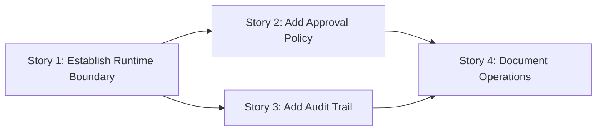

# Story DAG

- Workflow slug: demo
- Generated at: 2026-05-11T16:47:55Z
- Source: `.workflow/demo/stories.md`
- Validation status: valid
- Current stage: implementation-planning
- Active items: Story 2
- Deferred items: Story 4

This is a derived scheduler artifact. `state.md` remains the workflow source of truth.

## Lane Dependencies

- Depends on: -
- Blocked by: -
- Satisfied by: -

## Graph

## Execution Levels

| Level | Nodes |
| --- | --- |
| 1 | story-1 |
| 2 | story-2, story-3 |
| 3 | story-4 |

## Nodes

| ID | Story | Status | Depends On | Lane Blockers | Risk | QA | Review Focus |
| --- | --- | --- | --- | --- | --- | --- | --- |
| story-1 | Story 1 | completed | - | - | normal | no | standard acceptance and regression review |
| story-2 | Story 2 | active | story-1 | - | high | yes | deep QA and red-team review |
| story-3 | Story 3 | ready | story-1 | - | high | yes | deep QA and red-team review |
| story-4 | Story 4 | deferred | story-2, story-3 | - | normal | no | standard acceptance and regression review |
