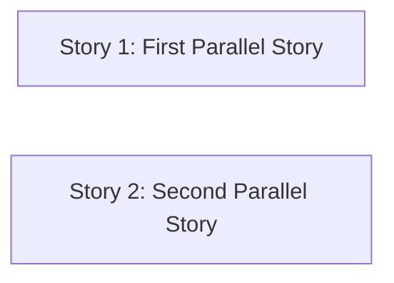

# Story DAG

- Workflow slug: demo
- Generated at: 2026-05-11T17:07:17Z
- Source: `.workflow/demo/stories.md`
- Validation status: valid
- Current stage: implementation-planning
- Active items: -
- Deferred items: -

This is a derived scheduler artifact. `state.md` remains the workflow source of truth.

## Lane Dependencies

- Depends on: -
- Blocked by: -
- Satisfied by: -

## Graph

## Execution Levels

| Level | Nodes |
| --- | --- |
| 1 | story-1, story-2 |

## Nodes

| ID | Story | Status | Depends On | Lane Blockers | Write Paths | Risk | QA | Review Focus |
| --- | --- | --- | --- | --- | --- | --- | --- | --- |
| story-1 | Story 1 | ready | - | - | src/api | normal | no | standard acceptance and regression review |
| story-2 | Story 2 | ready | - | - | src/api/users | normal | no | standard acceptance and regression review |
